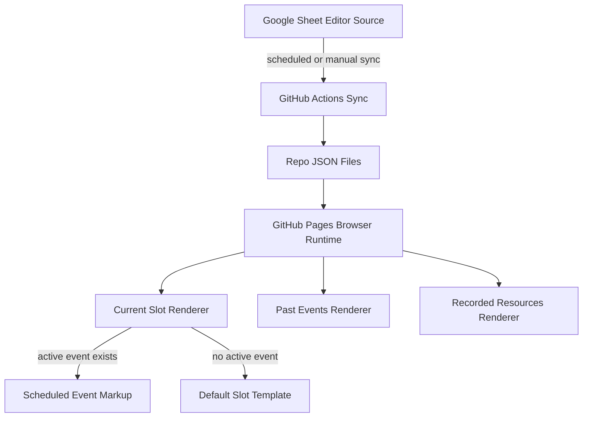

# Ashrafiyya Content Automation Roadmap

## Current Shape

The site is currently a static GitHub Pages app centered on [`index.html`](/Users/madeel/Projects/ashrafiyya/islamic/index.html), [`style.css`](/Users/madeel/Projects/ashrafiyya/islamic/style.css), and [`script.js`](/Users/madeel/Projects/ashrafiyya/islamic/script.js). The content that needs migration is hard-coded in:

- [`index.html`](/Users/madeel/Projects/ashrafiyya/islamic/index.html): current Programs, Previous Programs, and Recorded Resources markup.
- [`script.js`](/Users/madeel/Projects/ashrafiyya/islamic/script.js): existing page behavior, layout recalculation, expandable descriptions, and custom recorded-resource scrollbars.
- [`style.css`](/Users/madeel/Projects/ashrafiyya/islamic/style.css): established visual contract for `.program-card-v4`, `.program-item`, `.event-details`, `.event-card`, `.button-container`, `.video-item`, and recorded-resource columns.

The migration must keep those class names and card structures as the styling contract. Runtime content should come from repo JSON, not directly from Google Sheets.

## Target Model

Use repo JSON as the browser runtime source:

- [`data/program-slots.json`](/Users/madeel/Projects/ashrafiyya/islamic/data/program-slots.json): developer-controlled permanent current slots, default content, default registration button, and optional default HTML/template fragments.
- [`data/events.json`](/Users/madeel/Projects/ashrafiyya/islamic/data/events.json): time-bound scheduled/past events, eventually synced from Google Sheets.
- [`data/videos.json`](/Users/madeel/Projects/ashrafiyya/islamic/data/videos.json): recorded resource metadata.
- [`data/meta.json`](/Users/madeel/Projects/ashrafiyya/islamic/data/meta.json): schema version, generated timestamp, and sync metadata.

For The Heart of Care, the first slot must store both structured default fields and the current default template/button information so JS renderers can reproduce the existing markup without relying on the old hard-coded HTML. In the static site, use plain JavaScript plus JSDoc-style schema comments unless a later phase intentionally introduces a build step.

## Commit Plan

### 0. Baseline Checkpoint

- Review current live behavior locally or in browser before edits.
- Capture screenshots or written notes for Programs, Previous Programs, and Recorded Resources.
- No production code change required unless adding a short migration note.
- Pause here for user review and commit before moving to Phase 1. If no files changed, no commit is needed.

Suggested commit if docs are added: `docs: capture baseline for content automation migration`

### 1. Add Initial Data Directory Without Runtime Use

- Add `/data/` with `program-slots.json`, `events.json`, `videos.json`, and `meta.json`.
- Use valid JSON only. No runtime code should read these files yet.
- Seed `program-slots.json` with the known current slot order:
  - `health_heart_of_care`
  - `health_rise_to_respond`
  - `circles_kayfiyyat_salat`
  - `itqan_al_durr`
- For `health_heart_of_care`, store the current default template fields: title, description, `Status: More Coming Soon`, default button text, default href, disabled/placeholder state, and any exact HTML fragment needed by renderer development.
- Pause here for user review and commit before moving to Phase 2.

Suggested commit: `feat: add initial content data files for program migration`

### 2. Document Slot IDs And Data Contract

- Add [`docs/content-schema.md`](/Users/madeel/Projects/ashrafiyya/islamic/docs/content-schema.md).
- Define branch IDs, slot IDs, event lifecycle rules, button states, and rendering boundaries.
- Explicitly state that sheet data is data-only and cannot control CSS, arbitrary HTML, or layout.
- Document that default slot templates are repo-controlled and must restore when scheduled events expire.
- Pause here for user review and commit before moving to Phase 3.

Suggested commit: `docs: define slot schema and content rendering contract`

### 3. Add Safe JSON Loading Utilities

- In [`script.js`](/Users/madeel/Projects/ashrafiyya/islamic/script.js), add data-loading helpers without replacing visible content.
- Add helpers such as `fetchJsonWithTimeout`, `loadContentData`, `validateProgramSlots`, `validateEvents`, and `validateVideos`.
- Fail gracefully: log clear errors and leave existing hard-coded HTML untouched if data is missing or invalid.
- Run the page and confirm no visible changes.
- Pause here for user review and commit before moving to Phase 4.

Suggested commit: `feat: add safe repo JSON loading utilities`

### 4. Add Heart Of Care Template Renderer Behind A Non-Live Mount

- Add renderer functions in [`script.js`](/Users/madeel/Projects/ashrafiyya/islamic/script.js), still without replacing production content.
- Implement helpers for:
  - current program item markup,
  - detail rows,
  - button rendering,
  - placeholder/disabled button behavior,
  - safe text insertion and allowed minimal inline markup handling.
- Render The Heart of Care default template into a hidden or dev-only comparison container.
- Confirm generated markup matches the existing `.program-item`, `.event-details`, `.detail-row`, `.button-container`, and `.insta-link insta-link-light` structure.
- Pause here for user comparison and commit before moving to Phase 5.

Suggested commit: `feat: add Heart of Care slot renderer behind test mount`

### 5. Migrate The Heart Of Care Current Slot

- Replace only The Heart of Care hard-coded current slot in [`index.html`](/Users/madeel/Projects/ashrafiyya/islamic/index.html) with a stable mount point, for example `data-program-slot="health_heart_of_care"`.
- On load, render from `program-slots.json` and `events.json`.
- Required behavior:
  - if no active Heart of Care event exists, render the stored default template and default registration button;
  - if an active event is later assigned to this slot, render that event;
  - if data loading fails, preserve a non-blank fallback path.
- Confirm the registration button reverts to the default configuration when there is no active event.
- Pause here for user review and commit before touching Rise to Respond or moving to Phase 6.

Suggested commit: `feat: render Heart of Care slot from repo data`

### 6. Migrate Heart Of Care Past Events

- Move Heart of Care past events into `events.json` with `slot_id: health_heart_of_care` and `branch: health`.
- Add branch/slot filtering for past-event cards.
- Replace only the relevant Heart of Care entries inside the Ashrafiyya Health past-events group after dynamic output matches.
- Keep other Health past events, including Rise to Respond, unchanged until their phase.
- Pause here for user review and commit before moving to Phase 7.

Suggested commit: `feat: render Heart of Care past events from repo data`

### 7. Migrate Rise To Respond Current Slot

- Add `health_rise_to_respond` default slot data and current scheduled event data.
- Render its active/upcoming event from repo JSON.
- Preserve its current title, description, date, time, venue, and Zeffy registration link.
- Verify both states by testing with the active event present and temporarily absent in local data.
- Pause here for user review and commit before moving to Phase 8.

Suggested commit: `feat: render Rise to Respond slot from repo data`

### 8. Migrate Rise To Respond Past Events

- Move Rise to Respond past-event cards into `events.json`.
- Render them under Ashrafiyya Health with deterministic sorting.
- Ensure there are no duplicates between legacy hard-coded entries and dynamic entries.
- Pause here for user review and commit before moving to Phase 9.

Suggested commit: `feat: render Rise to Respond past events from repo data`

### 9. Migrate Ashrafiyya Circles Current Slots Top To Bottom

- Migrate `circles_kayfiyyat_salat` next, preserving its current default coming-soon state and registration button.
- If more Circles current slots are added before this work starts, migrate them one at a time in visual order.
- Pause here for user review and commit after each Circles current slot before migrating the next slot or moving to Phase 10.

Suggested commit pattern: `feat: render <slot-id> slot from repo data`

### 10. Migrate Ashrafiyya Circles Past Events

- Move Circles past events into `events.json`.
- Render the Ashrafiyya Circles past-event group dynamically.
- Preserve labels, venues, dates, order, and scroll behavior.
- Pause here for user review and commit before moving to Phase 11.

Suggested commit: `feat: render Ashrafiyya Circles past events from repo data`

### 11. Migrate Ashrafiyya Itqan Current Slots

- Migrate `itqan_al_durr`, preserving its ongoing status, invite-only notes, and `mailto:admin@ashrafiyya.com` button.
- Keep the fallback/default behavior explicit even though this slot is ongoing.
- Pause here for user review and commit before moving to Phase 12.

Suggested commit: `feat: render Al-Durr slot from repo data`

### 12. Migrate Ashrafiyya Itqan Past Events

- Move Itqān past events into `events.json`.
- Render the Itqān past-event group dynamically.
- Pause here for user review and commit before moving to Phase 13.

Suggested commit: `feat: render Ashrafiyya Itqan past events from repo data`

### 13. Migrate Recorded Resources By Branch

- Add existing YouTube/video metadata to `videos.json`.
- Build render helpers for video items, YouTube embed URLs, thumbnail links, notes cards, and notes links.
- Migrate in branch order:
  - Health recorded resources,
  - Circles recorded resources,
  - Itqān recorded resources if present later.
- After each branch, re-run `initRecordedResourcesScrollbars()` after dynamic rendering so custom scrollbars wrap newly inserted `.video-item` elements.
- Pause here for user review and commit after each recorded-resource branch before migrating the next branch or moving to Phase 14.

Suggested commit pattern: `feat: render <branch> recorded resources from repo data`

### 14. Cleanup Legacy Markup After Local Migration

- Remove old hard-coded content only after every targeted current slot, past-events group, and recorded-resource group is dynamic.
- Remove temporary hidden comparison mounts and any feature flags used during migration.
- Keep CSS refactoring minimal unless dead selectors are proven unused.
- Pause here for full-site user review and commit before moving to Phase 15.

Suggested commit: `refactor: remove legacy hard-coded program content`

### 15. Add Local Content Validation

- Add a small validation script, for example [`scripts/validate-content.mjs`](/Users/madeel/Projects/ashrafiyya/islamic/scripts/validate-content.mjs).
- Validate required fields, date formats, branch IDs, slot IDs, button fields, video IDs, and duplicate IDs.
- Add an npm script only if the repo gains or already has package metadata; otherwise document direct `node scripts/validate-content.mjs` usage.
- Pause here for user review and commit before moving to Phase 16.

Suggested commit: `feat: add validation for repo content data`

### 16. Add Local Google Sheet Sync Script

- Add [`scripts/sync-google-sheet.mjs`](/Users/madeel/Projects/ashrafiyya/islamic/scripts/sync-google-sheet.mjs).
- Fetch published Google Sheet data or the chosen sheet export endpoint.
- Map rows into the approved JSON schema.
- Validate generated output before writing.
- Refuse to overwrite last known good JSON when sheet output is empty, malformed, or missing required fields.
- Keep this manual/local only at first.
- Pause here for user review and commit before moving to Phase 17.

Suggested commit: `feat: add local Google Sheet content sync`

### 17. Add Manual GitHub Actions Sync

- Add [`/.github/workflows/sync-content.yml`](/Users/madeel/Projects/ashrafiyya/islamic/.github/workflows/sync-content.yml).
- Start with `workflow_dispatch` only.
- Run validation before committing generated JSON.
- Commit and push only when generated content changes.
- Use minimum necessary permissions.
- Pause here for workflow review, manual test, and commit before moving to Phase 18.

Suggested commit: `feat: add manual content sync workflow`

### 18. Add Scheduled GitHub Actions Sync

- Add conservative cron scheduling to the existing workflow, starting with twice per day.
- Keep `workflow_dispatch` available.
- Confirm failed syncs leave repo JSON unchanged.
- Pause here for user review and commit before moving to Phase 19.

Suggested commit: `feat: schedule automated content sync workflow`

### 19. Optional Google Sheet Sync Button

- Add documentation or Apps Script reference for a Google Sheet custom menu that triggers the GitHub workflow.
- Store credentials in Script Properties, not sheet cells.
- Treat this as convenience automation only after scheduled/manual GitHub sync is stable.
- Pause here for user review and commit before moving to Phase 20.

Suggested commit: `docs: document optional Google Sheet sync trigger`

### 20. Operational Documentation

- Add maintainer and editor docs covering:
  - how slots work,
  - how default templates restore,
  - how to update the sheet,
  - how to trigger manual sync,
  - how to validate content locally,
  - how to recover from bad content.
- Pause here for final user review and commit.

Suggested commit: `docs: add content maintenance guide`

## Review Checklist For Every Stop Point

- Site loads with no fatal console errors.
- Programs section still visually matches existing layout.
- Migrated current slot never goes blank.
- Default slot button restores when no active event exists.
- Past events appear in the correct branch and are not duplicated.
- Recorded-resource videos and notes links still work.
- Changes are small enough for one logical commit.

## Key Implementation Notes

- Keep templates code-controlled and data-driven; do not allow editor-provided arbitrary HTML from Google Sheets.
- For The Heart of Care default template, store the current default template in repo data so render functions can import/use it, but keep the long-term renderer based on structured fields where possible.
- Use deterministic sorting through explicit `sort_order` plus event dates.
- Treat date/timezone rules as part of the schema before enabling automation.
- Do not introduce Google sync until local repo JSON rendering is stable across all target content areas.